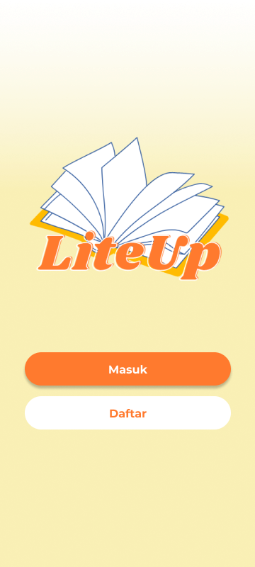

# Looks like you have stumbled upon LiteUp! Yippie!🥰

>“How can we improve the literacy rate in Indonesia with technology?”

Inspired by this question, LiteUp is built as a **FREE** application, for **EVERYONE** , to build up their reading habit and explore different genres through small motivating steps.

   

## How to Install

Simply go to our [release page](https://github.com/florentianayuwono/LiteUp/releases), download the suitable version for your device (we currently support web, desktop, iOS and android), and voila, LiteUp is all yours!
Enjoy the adventure, and please share with us your experience📖😉.

## More about LiteUp

LiteUp is developed as part of HackHERThon 2022 organized by Generation Girl, and is placed as 1st Runner Up🎖️.

Curious to know more? Head on here for our [pitch deck](https://docs.google.com/presentation/d/1TNQ3bTJLi8v58omao7V34BOzui7jELlJ37e9MUb2PNM/edit?usp=sharing), 
and of course, our [product proposal](https://docs.google.com/document/d/1V95Owj3T-vsRdQEYOfwnbL6Pe9LKDjyXnKjMYHC5K8c/edit?usp=sharing)!
